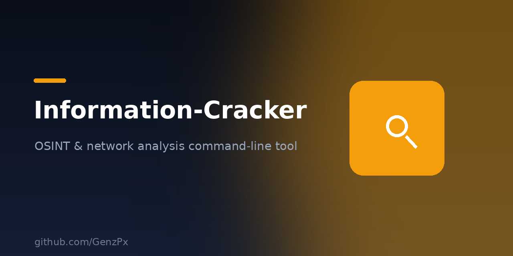

<p align="center">
  
</p>

# Information-Cracker

OSINT and network analysis command-line tool. IP geolocation, social media recon, web exploit scanning, network scanning and hash cracking. Educational use only.

## Install

```bash
git clone https://github.com/GenzPx/Information-Cracker.git
cd Information-Cracker
pip install -r requirements.txt
python3 IMC.py
```

## Features

- IP & geolocation tracking (ip-api.com)
- Social media recon
- Web exploit scanner
- Network scanner (scapy)
- Hash cracker
- Shodan integration

> ⚠️ For educational and authorized testing only.
